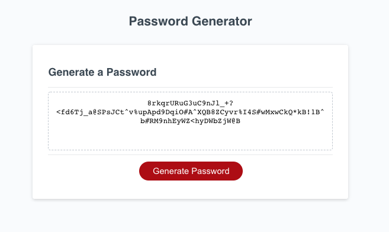

# password-generator

## Description
Secure Password Generator uses Javascript to generate a randomly secure password between 8 and 128 characters in length. 

Through a series of window prompts, the user selects the length and if they would like to include lowercase, uppercase, number, and special character values in their password. 

Conditional statements in the Javascript prevent the user from selecting a password length below 8 and above 128 and requires either a lowercase, uppercase, number, or special character to be selected. 

Values are then passed into a random algorithm to generate a password and display new password on the page. 

## Languages
* HTML
* CSS
* Javascript

## Functionality

* Javascript window.prompts(), confirm(), alert()

* Arrays and conditional statements

* Event listeners and reset value functions

* Uses a For Loop and Math Random to randomly generate password

## Website
https://joshacross.github.io/password-generator

## Referenced Images
